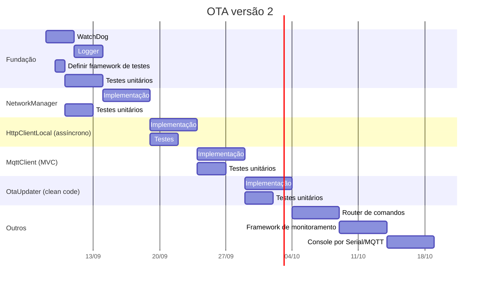

* OTA versão 2

** Implementação
*** WatchDog
*** Logger
*** NetworkManager
*** HttpClientLocal: assincronia
*** MqttClient: aplicar MVC
*** OtaUpdater: clean code
*** Router de comandos desacoplado da view
*** Definir e aplicar um framework de monitoramento
*** Console agnóstico: via serial, Mqtt

** Testes
*** Definir um framework de testes
*** Implementar testes unitários para as classes
**** NetworkManager, HttpClientLocal
**** OtaUpdater, MqttClient

